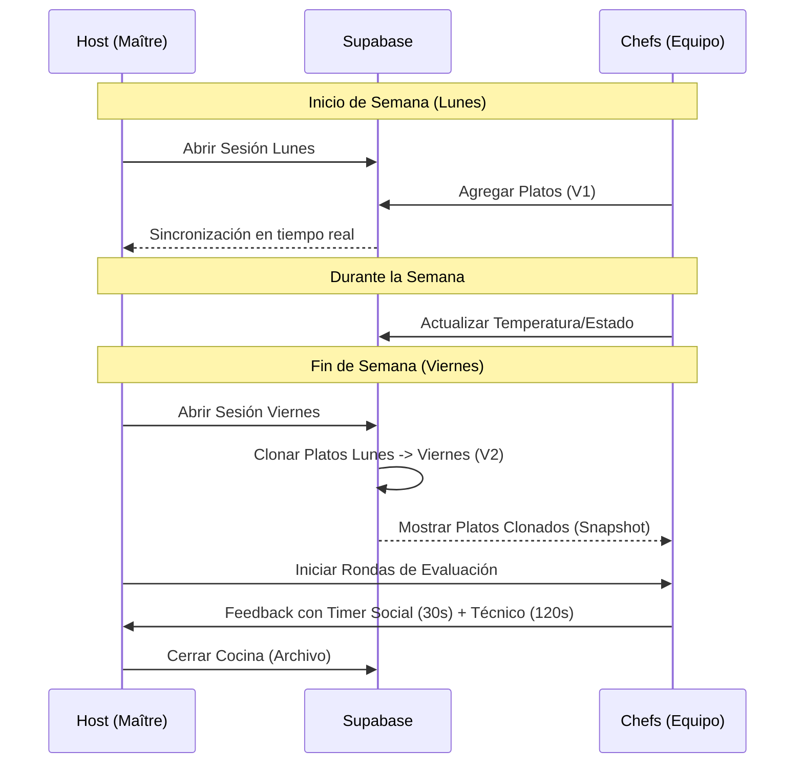

# KitchenSync 👨‍🍳🔥

**KitchenSync** es una herramienta interna de sincronización y gestión de proyectos diseñada para equipos de alto rendimiento. Utiliza una metáfora de cocina para hacer que el seguimiento del trabajo semanal sea lúdico, visual y extremadamente eficiente.

## 🚀 Propósito del Proyecto

El sistema está diseñado para manejar el ciclo de vida de la semana laboral en dos momentos clave:
1.  **Lunes (Planificación):** Apertura de la cocina donde los chefs (desarrolladores/miembros del equipo) cargan sus "platos" (proyectos/tareas).
2.  **Viernes (Resultados):** Cierre de la cocina donde se evalúa el progreso, se cierran platos servidos y se obtiene trazabilidad del avance semanal.

## 🛠️ Arquitectura Técnica

*   **Framework:** Next.js 16 (App Router)
*   **Base de Datos & Real-time:** Supabase (PostgreSQL + Realtime Presence/Broadcast)
*   **Testing:** Vitest + React Testing Library (Flujo TDD)
*   **Estilos:** Tailwind CSS 4
*   **Versionamiento:** Sistema de Snapshot Cloning para trazabilidad de sesiones.

## 📋 Flujo de Funcionamiento (Mermaid)

## ✨ Funcionalidades Clave

### 1. Sistema de Sesiones & Trazabilidad
- **Snapshot Cloning:** Al abrir una sesión de viernes, el sistema busca los platos del lunes anterior y los clona automáticamente incrementando su versión.
- **Trazabilidad Total:** Cada plato mantiene una referencia a su "padre" original, permitiendo comparar el inicio vs. el fin de semana.

### 2. Autenticación con Roles
- **Maître (Host):** Control absoluto, puede abrir/cerrar sesiones, iniciar rondas y limpiar la cocina. Usa Magic Link por seguridad.
- **Chefs:** Acceso fluido. Entran directo con su email y nombre para evitar fricciones de servidor de correo durante las reuniones.

### 3. Sincronización Real-time "Oído Cocina"
- **Presence:** Contador de chefs conectados y listos en tiempo real.
- **Broadcast:** Señales instantáneas para borrado masivo y notificaciones de estado "Listo".
- **Real-time DB:** Los cambios en platos se reflejan en milisegundos para todos los usuarios.

### 4. Timer de Evaluación de Dos Fases
- **Fase Social (30s):** Tiempo dedicado a hablar de lo personal (finde, planes, estado de ánimo).
- **Fase Técnica (120s):** Tiempo dedicado a la presentación del plato/proyecto.
- Transición automática y campana de aviso.

## 🧪 Calidad y Robustez
El proyecto cuenta con una suite de tests automatizados que aseguran:
- **Seguridad:** Protección de rutas y controles de Host.
- **Integridad:** Trazabilidad de versiones durante la clonación.
- **Concurrencia:** Resistencia a race conditions cuando múltiples chefs interactúan simultáneamente.

---
